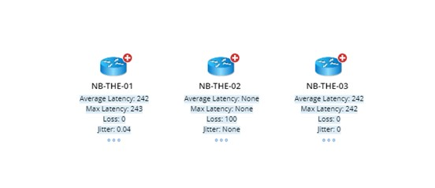
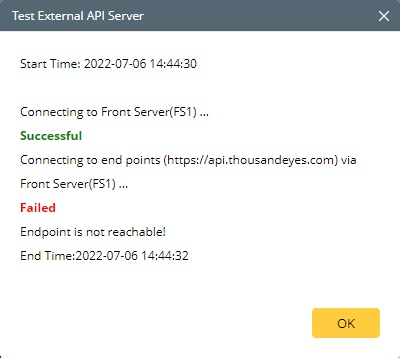

NetBrain Integration Deployment Guide
=====================================

Single Pane of Glass – ThousandEyes agent-to-server instant test
------------------------------------------------------------

Use Case
========

Description
-----------

Using publicly available ThousandEyes API, Netbrain has created an integration compatible with Netbrain Integration 8.0 (or newer) that enables Netbrain users to overlay ThousandEyes instant test results data on Netbrain maps.   
With this integration, Netbrain first initiate an instant test from specified ThousandEyes test agent to network devices. When the test results come back, Netbrain overlay the following extended information as attributes.

1. Average Latency
2. Maximum Latency
3. Minimum Latency
4. Loss
5. Jitter
6. Test Agent Id
7. Test Agent Name
8. Created Date

Netbrain Map with ThousandEyes Data Overlay
-----------------------------------------

The diagram below shows ThousandEyes instant data overlay on devices.

Pre-requisites
==============

Application Version
-------------------

| Application                 | Version                   |
|-----------------------------|---------------------------|
| NetBrain Integrated Edition | IEv8.0 and above          |

Network Connectivity
--------------------

| Source                | Destination       | Protocol   |
|-----------------------|-------------------|------------|
| NetBrain Front Server | ThousandEyes Cloud| HTTPS |

User Account and Privileges
---------------------------

| Application                 | User Account | Required Role Assignment(s) |
|-----------------------------|--------------|-----------------------------|
| NetBrain Integrated Edition | Required     | System Admin                |
| ThousandEyes cloud          | Required     | Client                      |

Deployment Instructions
=======================

Deploy Netbrain ThousandEyes API Adaptor
------------------------------------------

1.  Download NetBrain ThousandEyes API Adapter, ThousandEyes API Adaptor.py, from the NetBrain github and store locally on the machine typically used to connect to the NetBrain User Interface.

2.  Using a web browser, login to the NetBrain System Management UI using the System Admin credentials
>   http://\<NetBrain Web Server IP\>/admin

3.  In the NetBrain System Management UI, Navigate to Operations > API Adaptors.

4.  In the API Adaptors screen, click “Add”.

5.  Complete the Add Adaptor dialog screen as follows:

>   **Adapter Name:** *ThousandEyes API Adaptor*

>   **Description:** *NetBrain ThousandEyes API Adaptor*

>   **Script:** *\<ThousandEyes API Adaptor.py\>*

6.  Review the adaptor configuration, then click “Save”.

7.  Log out of the Netbrain Integrated Edition System Management UI.

Create ThousandEyes API Server Connection
---------------------------------------

**Note:** If the environment has been deployed with multiple Front Servers,
repeat this section for each of the Front Servers.

1.  Using a web browser, login to the NetBrain Desktop UI using the System Admin credentials

    http://\<NetBrain Web Server IP\>

2.  Navigate to the NetBrain *API Server Manager*

    *Domain Management \> Operations \> API Server Manager*

3.  In the API Server Manager screen, click “Add”.

4.  Complete the Add API Server dialog screen as follows:

>   **Server Name:** *ThousandEyes API Server \<Front Server\>*

>   **Description:** *ThousandEyes*

>   **API Source Type:** *“ThousandEyes API Adaptor”*

>   **Endpoint:** *ThousandEyes information-only API endpoint (“https://api.thousandeyes.com”)*

>   **Username:** *ThousandEyes API username*

>   **Password:** *ThousandEyes API password* 

>   **Front Server/Front Server Group:** Select FS/FSG which would have reachability to ThousandEyes cloud services

5.  Click “Test” to initiate a connectivity test between the NetBrain front server and the ThousandEyes API endpoint configured. Pictured below is the result of a successful connectivity test followed by two typical failure scenarios: Incorrect credentials and connectivity between NetBrain and ThousandEyes cloud.

| **Successful Connection**  |                                    |
|----------------------------|-------------------------------------------------------------|
| **Error Scenario:** The entered credentials are incorrect. **Possible Resolution:** Confirm credentials specified in the ThousandEyes API Adaptor configuration and retry.                                         | |
| **Error Scenario:** ThousandEyes cloud endpoint is unreachable. **Possible Resolution:** Confirm that the NetBrain Front Server(s) can reach the ThousandEyes API endpoint using 3rd party tools (Ping, Traceroute, Wireshark). Or confirm your endpoint inserted correctly.  | |

Import ThousandEyes Data View Template
-------------------------------------

1.  Download the NetBrain ThousandEyes Dataview Template, *ThousandEyes agent-to-server Instant Test.xdvt*, from the NetBrain github and store locally on the machine used to connect to the NetBrain User Interface.
2.  Using a web browser, login to the NetBrain Desktop UI with the System Admin credentials

    *http://\<NetBrain Web Server IP\>*

3.  Navigate to the NetBrain *Data View Template Manager*

    *Start Menu (The Four Dashed Lines) \> Dynamic Map \> Data View Template Manager*

4.  Right-Click “Shared Templates in Tenant”, then click “New Folder”.

5.  Name the folder *ThousandEyes Single Pane of Glass*

6.  Right-Click the folder, then click “Import Template”

7.  In the *Import Data View Template* dialog, click “Add Data View Template …”

8.  Select the *ThousandEyes agent-to-server Instant Test.xdvt* file, then click “Open”.

9.  Confirm that the *Import Data View Template* dialog screen reflects the
    following information:

    **Name:** *ThousandEyes agent-to-server Instant Test.xdvt*

    **Size:** *8.00k*

    **Status:** *Ready*

    **Related Resources:** *1 Parser*

10. Click “Import” to initiate the import of the data view template to the
    NetBrain system.

>   **Note:** On successful completion, the status will transition from *Ready*
>   to *Successful.* If any other status is reported, retry the operation, then
>   contact NetBrain support.

11. Navigate to NetBrain *Parser Library*

>   *Start Menu (The Four Dashed Lines) \> Automation \> Parser Library*

12. In the Parser Library, search for “ThousandEyes “. One ThousandEyes parser should be returned in the search results:

>   *ThousandEyes agent-to-server Instant Test*

13. Double-click *ThousandEyes agent-to-server Instant Test* to open the custom parser in the *Parser Editor*.

14. In the Parser Editor, update the *Parser Type* associated with the *ThousandEyes Parser* to the following:

>   **Parser Type:** *API, ThousandEyes API Adapter*

15. Click the Save icon in the upper-right corner of the screen, then close the browser tab.

Creating ThousandEyes Enabled Device Groups and apply API settings
-----------------------------------------

**Note:** If the environment has been deployed with multiple Front Servers,
repeat this section for each of the Front Servers.

1.  Navigate to the NetBrain *Device Group Manager.*

    *Start Menu (The Four Dashed Lines) \> Device Group*

2.  In the *Device Group Manager*, right-click the “Public” folder, then click “New Device Group”.

3.  In the *Device Group Properties* dialog, Name the device group as follows:

4.  Under *Devices and Interfaces*, click “+Dynamic Search”, then “Dynamic Search Device”.

5.  Search Scope: setup search scope to add all ThousandEyes enabled device in group

    **Search Scope:** *All Devices (default)*

    **Device Criteria:** *Front Server \| Matches \| \<Front Server\>*

    where *\<Front Server\>* is the front server specified in step 3.

6.  Click “Search” to populate the device list to front server mapping.

7.  Click “OK” button to create a *Dynamic Search* association.

8.  In the *Device Group Properties* dialog, click “OK” to complete Device Group
    creation.

9.  In the *Device Group Manager*, right-click the group object, then click “Open Group Map”.

10. In the resulting NetBrain device group map, right-click any device, then
    click “Shared Device Settings”.

11. In the *Shared Device Settings…* dialog, click the select the API tab then
    populate the dropdown fields as follows:

    *ThousandEyes API Adaptor \| ThousandEyes API Server \<Front Server\> \|
    \<Select Front Server\>*

12. Check “Apply above Settings to device group”, then select *ThousandEyes DG
    \<Front Server Hostname\>*

13. In the API tab content table, check *ThousandEyes API Adaptor*

14. Click “Submit”.

15. Repeat steps 1-14 for each additional deployed Front Server.

Visualizing ThousandEyes Instant Test Data with NetBrain Data View Template
================================================================

On-Demand Data Overlay
----------------------

1.  From the NetBrain Desktop Management UI, open the desired map to overlay
    ThousandEye Instant Data.

2.  In *Dynamic Data View* tab, search for “ThousandEyes agent-to-server instant test”.

3.  In the *Preview – Data View Template* dialog, click “Apply”

4.  On the NetBrain map, confirm that the *Cache/Live* data source switch is set
    to *Live.*

5.  Confirm that the objects (devices) are properly instrumented with the expected ThousandEyes agent-to-server instant test data.

    **Note:** Overlay of the ThousandEyes data may take seconds-to-minutes to complete refresh depending on the number of devices on the map.

Troubleshooting
===============

If there are any problems encountered during deployment or integration of NetBrain with ThousandEyes, contact NetBrain Support at *support\@netbraintech.com*.
