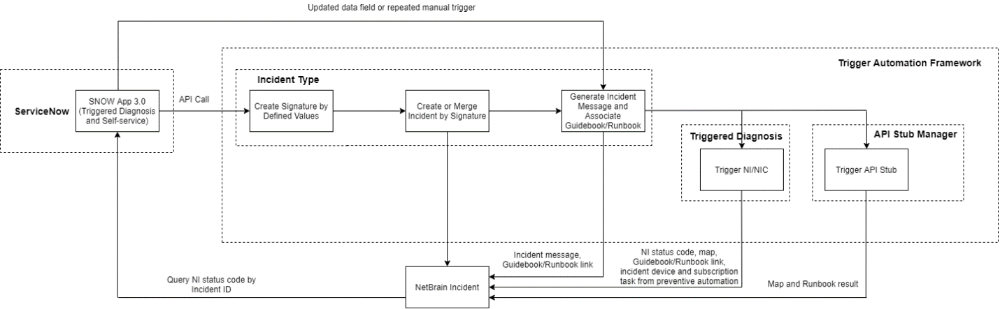

# Triggered Automation Framework (TAF) User Guide

This user guide is an overall introduction and demostration TAF flow.
The purpose is to help developers better understand the use case and the function of each REST API.
There are 2 complete samples being provided.
1. Manually Trigger a Self-Service Enabled Diagnosis
2. Auto-Trigger

## Framework Introduction

> **TAF Flow**



> **REST APIs**

|**No.**|**API Link**|**API URI**|**Description**|
|-----|-----|-----|-----|
|1|[Create IT System Data Model](https://github.com/NetBrainAPI/NetBrain-REST-API-R11/blob/main/REST%20APIs%20Documentation/TAF%20(Triggered%20Automation%20Framework)/1%20-%20Create%20IT%20System%20Data%20Model%20API.md)|API/V1/TAF/AutoMapping|Use this API to create an IT System Data Model definition in System Management/Integrated IT Systems/Integrated IT Systems. This API helps to automate the IT System Data Model creation process.|
|2|[Auto Trigger](https://github.com/NetBrainAPI/NetBrain-REST-API-R11/blob/main/REST%20APIs%20Documentation/TAF%20(Triggered%20Automation%20Framework)/2%20-%20Auto%20Trigger%20API.md)|API/V1/TAF/Auto|Use this API to send a third party system event data to NetBrain.|
|3|[Get Trigger Result](https://github.com/NetBrainAPI/NetBrain-REST-API-R11/blob/main/REST%20APIs%20Documentation/TAF%20(Triggered%20Automation%20Framework)/3%20-%20Get%20Trigger%20Result%20API.md)|API/V1/TAF/Result|Use this API to query triggered task results.|
|4|[Get Triggerd Diagnosis Definition](https://github.com/NetBrainAPI/NetBrain-REST-API-R11/blob/main/REST%20APIs%20Documentation/TAF%20(Triggered%20Automation%20Framework)/4%20-%20Get%20Trigger%20Diagnosis%20Definition%20API.md)|API/V1/TAF/ManuallyDiagnosis|Use this API to query trigger definition on NetBrain end.|
|5|[Manually Trigger](https://github.com/NetBrainAPI/NetBrain-REST-API-R11/blob/main/REST%20APIs%20Documentation/TAF%20(Triggered%20Automation%20Framework)/5%20-%20Manually%20Trigger%20API.md)|API/V1/TAF/Manually|Use this API to make a specific trigger task.|
|6|[Update Incident Message](https://github.com/NetBrainAPI/NetBrain-REST-API-R11/blob/main/REST%20APIs%20Documentation/TAF%20(Triggered%20Automation%20Framework)/6%20-%20Update%20Incident%20Message%20API.md)|API/V1/TAF/Updated|Use this API to update event data to an existing NetBrain incident as incident message. The event data will be transformed to NetBrain incident message by the target incident related Incident Type Incident Message setting.|
|7|[Get Temporary Incident Portal Access Token](https://github.com/NetBrainAPI/NetBrain-REST-API-R11/blob/main/REST%20APIs%20Documentation/TAF%20(Triggered%20Automation%20Framework)/7%20-%20Get%20Temporary%20Incident%20Portal%20Access%20Token%20API.md)|API/V1/portal-auth-ticket|Use this API to get a temporary Incident Portal access token. The token will be appended into the URL to automatically get users into an Incident Portal record. This API can be used for a particular 3rd party system integration to automatically authenticate the 3rd party system users to a NetBrain Incident Portal record, which is triggered by the 3rd party system instance.|
|8|[Verify User Permission](https://github.com/NetBrainAPI/NetBrain-REST-API-R11/blob/main/REST%20APIs%20Documentation/TAF%20(Triggered%20Automation%20Framework)/8%20-%20Verify%20User%20Permission%20API.md)|API/V1/CMDB/Users/checkPermission|Use this API to verify the current user privileges agains NetBrain system.|


## Manually Trigger a Self-Service Enabled Diagnosis

The sample below provides a NetBrain Class with mutiple necessary functions encapsulated.<br>
The main function below demonstrates how the self-service enabled diagnosis definition objects can be retrieved and interpreted to the front end for users to provide input values and run.

Basic flow:
1. [Get Triggered Diagnosis Definition](https://github.com/NetBrainAPI/NetBrain-REST-API-R11/blob/main/REST%20APIs%20Documentation/TAF%20(Triggered%20Automation%20Framework)/4%20-%20Get%20Trigger%20Diagnosis%20Definition%20API.md)
2. Make the [manual trigger](https://github.com/NetBrainAPI/NetBrain-REST-API-R11/blob/main/REST%20APIs%20Documentation/TAF%20(Triggered%20Automation%20Framework)/5%20-%20Manually%20Trigger%20API.md) with user provided input based on diagnosis definition
3. [Get Trigger Result](https://github.com/NetBrainAPI/NetBrain-REST-API-R11/blob/main/REST%20APIs%20Documentation/TAF%20(Triggered%20Automation%20Framework)/3%20-%20Get%20Trigger%20Result%20API.md)


```python
# -*- coding: utf-8 -*-
"""
Created on Thu Feb 10 15:26:49 2022

@author: songh
"""

# import json
from requests import Session, packages
from urllib.parse import urljoin
from urllib3.exceptions import InsecureRequestWarning

# Suppress only the single warning from urllib3 needed.
packages.urllib3.disable_warnings(category=InsecureRequestWarning)


class NBRequestSessionBase(Session):
    def __init__(self, prefix_url):
        self.prefix_url = prefix_url.rstrip("/") + "/"
        super(NBRequestSessionBase, self).__init__()
        self.verify = False
        self.user = {}

    def request(self, method, url, *args, **kwargs):
        if url.startswith("http://") or url.startswith("https://"):
            url = url.strip()
        else:
            url = urljoin(self.prefix_url, url.lstrip("/"))

        if self.user.get('token', None) is not None:
            self.headers.update({"Token": self.user['token']})        
            
        self.headers.update({"Content-Type":"application/json","Accept":"application/json"})

        return super(NBRequestSessionBase, self).request(method, url, * args, **kwargs)

    def get_tenant_guid_by_name(self, tenant_name):
        url = '/API/V1/CMDB/Tenants'
        data = self.get(url).json()
        # print(data['tenants'])
        if len(data['tenants']) > 0:
            for tenant in data['tenants']:
                if tenant['tenantName'] == tenant_name:
                    return tenant['tenantId']
        return None

    def get_domain_guid_by_name(self, tenant_guid, domain_name):
        url = '/API/V1/CMDB/Domains?tenantId=' + tenant_guid
        data = self.get(url).json()
        # print(data['domains'])
        if len(data['domains']) > 0:
            for domain in data['domains']:
                if domain['domainName'] == domain_name:
                    return domain['domainId']
        return None

    def set_tenant_domain_guid(self, tenant_guid, domain_guid):
        # if tenant_guid is not None and domain_guid is not None:
        if tenant_guid is None:
            raise ValueError("tenant_guid must not empty!")
        self.headers.update({"TenantGuid": tenant_guid})

        if domain_guid is not None:
            self.headers.update({"DomainGuid": domain_guid})


class LegacyThirdPartyAPIRequestSession(NBRequestSessionBase):

    def set_token(self, token):
        self.user["token"] = token

    def login(self, username, password):
        response = self.post('/API/V1/Session',
                      auth=(username, password)).json()
        if response["statusCode"] == 790200:
            self.user["token"] = response["token"]
        else:
            raise ValueError(response["statusDescription"])
    
    def logout(self):
        self.delete("/API/V1/Session")
    
    def set_tenant_domain(self,tenant_name,domain_name):
        tenant_guid = self.get_tenant_guid_by_name(tenant_name)
        domain_guid = self.get_domain_guid_by_name(tenant_guid,domain_name)
        self.set_tenant_domain_guid(tenant_guid,domain_guid)
        
    def get_product_version(self):
        return self.get("/API/v1/System/ProductVersion").json()
        
    def create_event_metadata(self, event_metadata):
        response = self.post("/API/V1/TAF/AutoMapping",
                             data = json.dumps(event_metadata)).json()
        if response:
            return "Succeeded"
        else:
            raise ValueError(response["statusDescription"])
    
    def set_taf_scope(self, scope=None, tenant_name=None, domain_name=None):
        option = {}
        if any([scope, tenant_name, domain_name]):
            if scope is None:
                if all([tenant_name, domain_name]):
                    tenant_guid = self.get_tenant_guid_by_name(tenant_name)
                    domain_guid = self.get_domain_guid_by_name(tenant_guid,
                                                               domain_name)
                    option["tenantId"] = tenant_guid
                    option["domainId"] = domain_guid
                else:
                    raise ValueError("Either tenant_name or domain_name \
                                     is not provided.")
            else:
                option["scope"] = scope
        else:
            raise ValueError("Please provide scope or tenant_name & domain_name.")
        return option
    
    def publish_event(self, event_data, source, category,
                      scope=None, tenant_name=None, domain_name=None):
        """document test"""
        body = {
            "specificData":event_data,
            "option":{
                "source":source,
                "category":category
                }
            }
        
        option = self.set_taf_scope(scope=scope,tenant_name=tenant_name,
                                    domain_name=domain_name)
        body["option"] = {**body["option"], **option}
   
        response = self.post("/API/V1/TAF/Auto",
                             data=json.dumps(body)).json()
        if response["statusCode"] == 790200:
            return response
        else:
            raise ValueError(response["statusDescription"])
    
    def get_trigger_result(self, taskId, scope=None, 
                           tenant_name = None, domain_name = None):
        """
        Get trigger result
        :taskId: taskId returned from publish_event(), str
        """
        body = {
            "option":{
                "taskId":taskId
                }
            }
        option = self.set_taf_scope(scope=scope,tenant_name=tenant_name,
                                    domain_name=domain_name)
        body["option"] = {**body["option"], **option}
        response = self.post("/API/V1/TAF/Result",
                              data=json.dumps(body)).json()
        if response["statusCode"] == 790200:
            return response
        else:
            raise ValueError(response["statusDescription"])
            
    def get_diagnosis_definition(self, scope=None, tenant_name=None, 
                                 domain_name=None, type=1):
        body = {"type":type}
        
        option = self.set_taf_scope(scope=scope,tenant_name=tenant_name,
                                    domain_name=domain_name)
        body["option"] = option
        
        response = self.post("/API/V1/TAF/ManuallyDiagnosis",
                             data=json.dumps(body)).json()
        if response["statusCode"] == 790200:
            return response
        else:
            raise ValueError(response["statusDescription"])
            
    def manual_trigger(self, event_data, source, category,
                       manuallyParams, diagnosisId, scope=None, 
                       tenant_name=None, domain_name=None):
        body = {
            "specificData":event_data,
            "option":{
                "source":source,
                "category":category,
                "diagnosisId":diagnosisId,
                "manuallyParams":manuallyParams
                }
            }
        
        option = self.set_taf_scope(scope=scope,tenant_name=tenant_name,
                                    domain_name=domain_name)
        body["option"] = {**body["option"], **option}
   
        response = self.post("/API/V1/TAF/Manually",
                             data=json.dumps(body)).json()
        if response["statusCode"] == 790200:
            return response
        else:
            raise ValueError(response["statusDescription"])
            
    def update_inc_message(self, event_data, source, category,
                           nbIncidentId, scope=None, tenant_name=None,
                           domain_name=None):
        body = {
            "specificData":event_data,
            "option":{
                "source":source,
                "category":category,
                "nbIncidentId":nbIncidentId
                }
            }
        
        option = self.set_taf_scope(scope=scope,tenant_name=tenant_name,
                                    domain_name=domain_name)
        body["option"] = {**body["option"], **option}
   
        response = self.post("/API/V1/TAF/Updated",
                             data=json.dumps(body)).json()
        if response["statusCode"] == 790200:
            return response
        else:
            raise ValueError(response["statusDescription"])
            
    def check_user_permission(self, tenantName, domainName, privileges=["systemManagement"]):
        """
        Validate user permission to ensure the selected API user has
        sufficient privileges to perform the triggered automation against
        NetBrain TAF. (systemManagement is required for TAF)
        :privileges: privilege names, list
        systemManagement
        domainAdmin
        accessToLiveNetwork
        """
        
        tenantId = self.get_tenant_guid_by_name(tenantName)
        domainId = self.get_domain_guid_by_name(tenantId, domainName)
        
        body = {
            "tenantId":tenantId,
            "domainId":domainId,
            "permissions":privileges
            }
        response = self.post("/API/V1/CMDB/Users/checkPermission",
                             data=json.dumps(body)).json()
        
        if response["statusCode"] == 0:
            return response["privileges"]
        else:
            raise ValueError(response["statusDescription"])
            

import json
import time
import getpass

if __name__ == '__main__':
    
    '''
    [DEV USE ONLY] Default NetBrain server connection info.
    '''
    default_endpoint = "https://unicorn-new.netbraintech.com"
    default_username = "api_user"
    default_password = "api_password"
    
    '''
    User input to initiate NetBrain connection.
    '''
    print('''NetBrain 11 Triggered Automation Framework [TAF] Sample\
          \r\nEstablish NetBrain connection...''')
    endpoint = input("NetBrain URL: ")
    username = input("NetBrain API Username: ")
    password = getpass.getpass(prompt="NetBrain API Password: ", stream=None)
    
    '''
    Use default NetBrain connection setting if endpoint is not provided.
    For test purpose only.
    '''
    
    if endpoint == "":
        endpoint = default_endpoint
        username = default_username
        password = default_password
        
    '''
    Initiate NetBrain connection
    '''
    api = LegacyThirdPartyAPIRequestSession(endpoint + '/servicesapi')
    api.login(username, password)
    print(api.get_product_version())
    
    '''
    Input trigger event data
    '''
    event = {}
    print("Input your event data attribute key/value pairs for incident merging...")
    event_attr_amount_input = input("Attribute amount [Input a number]: ")
    event_attr_amount = int(event_attr_amount_input)
    for i in range(event_attr_amount):
        print("{} of {} event attribute input:"
              .format(i+1,event_attr_amount))
        attr_key = input("Attribute Key: ")
        attr_value = input("Attribute Value: ")
        event[attr_key] = attr_value
    print("Review your event input:")
    print(event)
    
    '''
    Initiate manual trigger options
    '''
    trigger_maps = {}
    
    '''
    Pull existing self-service list [Map Execution Mode]
    '''
    trigger_map_list = api.get_diagnosis_definition(scope="Demo",
                                                    type=1)["diagnosises"]    
    print("[Manual Trigger Map]:")
    trigger_count = 1
    for trigger_map in trigger_map_list:
        trigger_maps[trigger_count] = trigger_map
        print("{} - {}"
              .format(trigger_count,trigger_maps[trigger_count]["name"]))
        trigger_count += 1
    
    '''
    Pull existing self-service list [Diagnosis Execution Mode]
    '''
    trigger_diag_list = api.get_diagnosis_definition(scope="Demo", 
                                                     type=2)["diagnosises"]
    print("[Manual Trigger Diagnosis]: ")
    trigger_diags = {}
    for trigger_diag in trigger_diag_list:
        trigger_maps[trigger_count] = trigger_diag
        print("{} - {}"
              .format(trigger_count,trigger_maps[trigger_count]["name"]))
        trigger_count += 1
    
    '''
    Initiate trigger body for manual trigger
    '''
    trigger_body = {
        "specificData":event,
        "option":{
            "scope":"Demo",
            "source":"https://notapplicable.com",
            "category":"Event",
            "manuallyParams":[]
            }
        }
    
    '''
    Take selected manual trigger parameter inputs
    '''
    trigger_select = int(input("Select a manual trigger [Example: 1]: "))
    
    print("[{}] is selected".format(trigger_maps[trigger_select]["name"]))
    print("ID: {}".format(trigger_maps[trigger_select]["id"]))
    print("Name: {}".format(trigger_maps[trigger_select]["name"]))
    print("Input Diagnosis Parameters:")
    param_count = 0
    for p in trigger_maps[trigger_select]["params"]:
        print("Hint: {}".format(p["hint"]))
        trigger_body["option"]["manuallyParams"]\
            .append({"key":p["name"],"value":input("{}: ".format(p["name"]))})
    
    trigger_result = api.manual_trigger(event,
                                        trigger_body["option"]["source"],
                                        trigger_body["option"]["category"],
                                        trigger_body["option"]["manuallyParams"],
                                        trigger_maps[trigger_select]["id"],
                                        scope=trigger_body["option"]["scope"])
    print(trigger_result)
    
    while True:
        time.sleep(5)
        result = api.get_trigger_result(trigger_result["taskId"], scope="Demo")
        print(result)
        if result["status"] not in [0,1]:
            break
    
    api.logout()
```

    NetBrain 11 Triggered Automation Framework [TAF] Sample          
    Establish NetBrain connection...
    NetBrain URL: 
    NetBrain API Username: 
    NetBrain API Password: ········
    {'productVersion': '11', 'softwareVersion': '11.0', 'date': 'Tue Feb 22 14:01:08 2022 -0500', 'gitVersion': '93a4b57f267', 'statusCode': 790200, 'statusDescription': 'Success.'}
    Input your event data attribute key/value pairs for incident merging...
    Attribute amount [Input a number]: 2
    1 of 2 event attribute input:
    Attribute Key: hostname
    Attribute Value: US-BOS-R1
    2 of 2 event attribute input:
    Attribute Key: status
    Attribute Value: rebooted
    Review your event input:
    {'hostname': 'US-BOS-R1', 'status': 'rebooted'}
    [Manual Trigger Map]:
    1 - BGP self-service
    2 - Python Sample
    3 - Trigger_NIC_enable
    4 - Verify MTU Mismatch
    5 - IBGP Checks(1)(1)
    6 - Verify BGP source full mesh reachability issues
    7 - Verify BGP flapping
    8 - Verify MTU Mismatch (For Training)
    9 - Map and Verify Symptoms
    10 - jingDiag
    [Manual Trigger Diagnosis]: 
    11 - BGP self-service
    12 - High CPU Known Root Cause 1
    13 - Python Sample
    14 - Trigger_NIC_enable
    15 - Verify MTU Mismatch
    16 - IBGP Checks(1)(1)
    17 - Verify BGP source full mesh reachability issues
    18 - High CPU Known Root Cause 2
    19 - High CPU Known Root Cause 3
    20 - High CPU Known Root Cause 4
    21 - High CPU Known Root Cause 5
    22 - Verify BGP flapping
    23 - Running-Config-check
    24 - Circuit down(1)
    25 - Verify MTU Mismatch (For Training)
    26 - Map and Verify Symptoms
    27 - jingDiag
    Select a manual trigger [Example: 1]: 13
    [Python Sample] is selected
    ID: 79756585-4d0f-ac3b-c26e-aab19bf0eaf1
    Name: Python Sample
    Input Diagnosis Parameters:
    Hint: Input device name, like R1
    NIDevice: US-BOS-R1
    {'incidentId': '10015X', 'incidentUrl': 'i.html?id=10015X', 'incidentPortalUrl': 'i/10015X', 'taskId': 'c3b00306-890e-433c-ac77-952099179cf3', 'statusCode': 790200, 'statusDescription': 'Success.'}
    {'domainId': '9791c406-5135-40e2-bd61-3a7903d6b752', 'tenantId': '74f04b73-7368-e833-e4be-0a2bc6d44780', 'status': 2, 'statusDesc': 'Finished', 'NIResults': [{'id': 'f9a191f1-68f5-41af-9fb5-f64fb00f1918', 'name': 'Device Reboot US-BOS-R1', 'messages': [{'type': 2, 'message': 'US-BOS-R1 was rebooted recently. Uptime: 1 week, 3 days, 2 hours, 46 minutes Last reload reason: Unknown reason  '}], 'mapId': '377de0d4-8b42-48be-bb67-1f3c19ba2d97', 'niResultId': 'd28eb016-f028-4174-88ca-1c428322a0e0'}], 'statusCode': 790200, 'statusDescription': 'Success.'}
    

## Auto-Trigger

The Sample below overloaded Python Requests Module Session Class as NetBrain Request Session Base.<br>
The main function below demonstrates the major steps to push event data to NetBrain for incident type merging and auto-triggered diagnosis process, and eventually retrieve the diagnosis results.

Basic flow:

1. Push event data to NetBrain - [Auto Trigger](https://github.com/NetBrainAPI/NetBrain-REST-API-R11/blob/main/REST%20APIs%20Documentation/TAF%20(Triggered%20Automation%20Framework)/2%20-%20Auto%20Trigger%20API.md)
2. [Get Trigger Result](https://github.com/NetBrainAPI/NetBrain-REST-API-R11/blob/main/REST%20APIs%20Documentation/TAF%20(Triggered%20Automation%20Framework)/3%20-%20Get%20Trigger%20Result%20API.md) continuously with a certain interval set until the task is finished.


```python
# -*- coding: utf-8 -*-
"""
Created on Thu Feb 10 15:26:49 2022

@author: songh
"""

# import json
from requests import Session, packages
from urllib.parse import urljoin
from urllib3.exceptions import InsecureRequestWarning

# Suppress only the single warning from urllib3 needed.
packages.urllib3.disable_warnings(category=InsecureRequestWarning)


class NBRequestSessionBase(Session):
    def __init__(self, prefix_url):
        self.prefix_url = prefix_url.rstrip("/") + "/"
        super(NBRequestSessionBase, self).__init__()
        self.verify = False
        self.user = {}

    def request(self, method, url, *args, **kwargs):
        if url.startswith("http://") or url.startswith("https://"):
            url = url.strip()
        else:
            url = urljoin(self.prefix_url, url.lstrip("/"))

        if self.user.get('token', None) is not None:
            self.headers.update({"Token": self.user['token']})        
            
        self.headers.update({"Content-Type":"application/json","Accept":"application/json"})

        return super(NBRequestSessionBase, self).request(method, url, * args, **kwargs)

    def get_tenant_guid_by_name(self, tenant_name):
        url = '/API/V1/CMDB/Tenants'
        data = self.get(url).json()
        # print(data['tenants'])
        if len(data['tenants']) > 0:
            for tenant in data['tenants']:
                if tenant['tenantName'] == tenant_name:
                    return tenant['tenantId']
        return None

    def get_domain_guid_by_name(self, tenant_guid, domain_name):
        url = '/API/V1/CMDB/Domains?tenantId=' + tenant_guid
        data = self.get(url).json()
        # print(data['domains'])
        if len(data['domains']) > 0:
            for domain in data['domains']:
                if domain['domainName'] == domain_name:
                    return domain['domainId']
        return None

    def set_tenant_domain_guid(self, tenant_guid, domain_guid):
        # if tenant_guid is not None and domain_guid is not None:
        if tenant_guid is None:
            raise ValueError("tenant_guid must not empty!")
        self.headers.update({"TenantGuid": tenant_guid})

        if domain_guid is not None:
            self.headers.update({"DomainGuid": domain_guid})


class LegacyThirdPartyAPIRequestSession(NBRequestSessionBase):

    def set_token(self, token):
        """
        Token user - set token to request headers
        """
        self.user["token"] = token

    def login(self, username, password):
        """
        Local API user with credentials - obtain token
        """
        response = self.post('/API/V1/Session',
                      auth=(username, password)).json()
        if response["statusCode"] == 790200:
            self.user["token"] = response["token"]
        else:
            raise ValueError(response["statusDescription"])
    
    def logout(self):
        """
        Any type of user - logout
        """
        self.delete("/API/V1/Session")
    
    def set_tenant_domain(self,tenant_name,domain_name):
        tenant_guid = self.get_tenant_guid_by_name(tenant_name)
        domain_guid = self.get_domain_guid_by_name(tenant_guid,domain_name)
        self.set_tenant_domain_guid(tenant_guid,domain_guid)
        
    def get_product_version(self):
        """
        Get NetBrain version for TAF compatability checking
        """
        self.get("/API/v1/System/ProductVersion")
        
    def create_event_metadata(self, event_metadata):
        """
        Create event metadata (System Level)
        :event_metadata: metadata definition, dict object
        {
            "name":"API Sample",
            "description":"API Metadata definition sample",
            "source":"https://apisample.com",
            "categories":[
                {
                    "name":"incident",       
                    "fields":[
                        {
                            "name":"description",
                            "label":"description",
                            "type":"0"              
                        },
                        {
                            "name":"state",
                            "label":"state",
                            "type":"a",
                            "mappings":[
                                {
                                    "value":0,
                                    "label":"active"
                                },
                                {
                                    "value":1,
                                    "label":"closed"
                                }
                            ]
                        }
                    ]     
                }
            ]
        }
        """
        response = self.post("/API/V1/TAF/AutoMapping",
                             data = json.dumps(event_metadata)).json()
        if response:
            return "Succeeded"
        else:
            raise ValueError(response["statusDescription"])
    
    def set_taf_scope(self, scope=None, tenant_name=None, domain_name=None):
        """
        Invoked by the following functions to set TAF scope for multi-tenancy
        support.
        publish_event()
        get_diagnosis_definition()
        manual_trigger()
        update_inc_message()
        
        :scope: scope mapping in System level (Multi-tenancy mode), str
        :tenant_name & domain_name: tenant & domain name to indicate a 
        particular working domain, str
        """
        option = {}
        if any([scope, tenant_name, domain_name]):
            if scope is None:
                if all([tenant_name, domain_name]):
                    tenant_guid = self.get_tenant_guid_by_name(tenant_name)
                    domain_guid = self.get_domain_guid_by_name(tenant_guid,
                                                               domain_name)
                    option["tenantId"] = tenant_guid
                    option["domainId"] = domain_guid
                else:
                    raise ValueError("Either tenant_name or domain_name \
                                     is not provided.")
            else:
                option["scope"] = scope
        else:
            raise ValueError("Please provide scope or tenant_name & domain_name.")
        return option
    
    def publish_event(self, event_data, source, category,
                      scope=None, tenant_name=None, domain_name=None):
        """
        Auto Trigger - Publish event to NetBrain
        :scope: scope mapping in System level (Multi-tenancy mode), str
        :tenant_name & domain_name: tenant & domain name to indicate a 
        particular working domain, str
        """
        body = {
            "specificData":event_data,
            "option":{
                "source":source,
                "category":category
                }
            }
        
        option = self.set_taf_scope(scope=scope,tenant_name=tenant_name,
                                    domain_name=domain_name)
        body["option"] = {**body["option"], **option}
   
        response = self.post("/API/V1/TAF/Auto",
                             data=json.dumps(body)).json()
        if response["statusCode"] == 790200:
            return response
        else:
            raise ValueError(response["statusDescription"])
    
    def get_trigger_result(self, taskId, scope=None, 
                           tenant_name = None, domain_name = None):
        """
        Get trigger result
        :taskId: taskId returned from publish_event(), str
        """
        body = {
            "option":{
                "taskId":taskId
                }
            }
        option = self.set_taf_scope(scope=scope,tenant_name=tenant_name,
                                    domain_name=domain_name)
        body["option"] = {**body["option"], **option}
        response = self.post("/API/V1/TAF/Result",
                              data=json.dumps(body)).json()
        if response["statusCode"] == 790200:
            return response
        else:
            raise ValueError(response["statusDescription"])
            
    def get_diagnosis_definition(self, scope=None, tenant_name=None, 
                                 domain_name=None, type=1):
        """
        Get Triggered Diagnosis Definition
        :type: diagnosis type, int
        1 - map diagnosis
        2 - NI/NIC diagnosis
        """
        body = {"type":type}
        
        option = self.set_taf_scope(scope=scope,tenant_name=tenant_name,
                                    domain_name=domain_name)
        body["option"] = option
        
        response = self.post("/API/V1/TAF/ManuallyDiagnosis",
                             data=json.dumps(body)).json()
        if response["statusCode"] == 790200:
            return response
        else:
            raise ValueError(response["statusDescription"])
            
    def manual_trigger(self, event_data, source, category,
                       manuallyParams, diagnosisId, scope=None, 
                       tenant_name=None, domain_name=None):
        """
        Make a manual trigger to a particular defined diagnosis.
        :scope: scope mapping in System level (Multi-tenancy mode), str
        :tenant_name & domain_name: tenant & domain name to indicate a 
        particular working domain, str
        :diagnosisId: obtain UUID from get_diagnosis_definition(), str
        :manuallyParams: list of key/value pairs, List
        Sample:
        [
            {
                "key":"NIDevice",
                "value":"US-BOS-R1",
            }
        ]
        """
        body = {
            "specificData":event_data,
            "option":{
                "source":source,
                "category":category,
                "diagnosisId":diagnosisId,
                "manuallyParams":manuallyParams
                }
            }
        
        option = self.set_taf_scope(scope=scope,tenant_name=tenant_name,
                                    domain_name=domain_name)
        body["option"] = {**body["option"], **option}
   
        response = self.post("/API/V1/TAF/Manually",
                             data=json.dumps(body)).json()
        if response["statusCode"] == 790200:
            return response
        else:
            raise ValueError(response["statusDescription"])
            
    def update_inc_message(self, event_data, source, category,
                           nbIncidentId, scope=None, tenant_name=None,
                           domain_name=None):
        """
        Update message to an exisitng incident.
        The message is formated by the corresponding Incident Type message definition.
        :nbIncidentId: NetBrain incident ID, str
        """
        body = {
            "specificData":event_data,
            "option":{
                "source":source,
                "category":category,
                "nbIncidentId":nbIncidentId
                }
            }
        
        option = self.set_taf_scope(scope=scope,tenant_name=tenant_name,
                                    domain_name=domain_name)
        body["option"] = {**body["option"], **option}
   
        response = self.post("/API/V1/TAF/Updated",
                             data=json.dumps(body)).json()
        if response["statusCode"] == 790200:
            return response
        else:
            raise ValueError(response["statusDescription"])
            
    def check_user_permission(self, tenantName, domainName, privileges=["systemManagement"]):
        """
        Validate user permission to ensure the selected API user has
        sufficient privileges to perform the triggered automation against
        NetBrain TAF. (systemManagement is required for TAF)
        :privileges: privilege names, list
        systemManagement
        domainAdmin
        accessToLiveNetwork
        """
        
        tenantId = self.get_tenant_guid_by_name(tenantName)
        domainId = self.get_domain_guid_by_name(tenantId, domainName)
        
        body = {
            "tenantId":tenantId,
            "domainId":domainId,
            "permissions":privileges
            }
        response = self.post("/API/V1/CMDB/Users/checkPermission",
                             data=json.dumps(body)).json()
        
        if response["statusCode"] == 0:
            return response["privileges"]
        else:
            raise ValueError(response["statusDescription"])
            

import json
import time

if __name__ == '__main__':
    api = LegacyThirdPartyAPIRequestSession(
        'https://unicorn-new.netbraintech.com/servicesapi')

    api.login('api_user', 'api_password')
    tenant_guid = api.get_tenant_guid_by_name("Initial Tenant")
    print(tenant_guid)
    domain_guid = api.get_domain_guid_by_name(tenant_guid, "Demo-Lab")
    print(domain_guid)
    prod_ver = api.get('/API/v1/System/ProductVersion').json()
    print(prod_ver)
        
    """
    Auto Trigger
    """
    
    specific_data = {
        "hostname":"US-BOS-R1",
        "status":"rebooted"
        }
    
    task = api.publish_event(specific_data,source="https://notapplicable.com",
                      category="Event", scope="Demo")
    print(task)
    
    while True:
        time.sleep(5)
        result = api.get_trigger_result(task["taskId"], scope="Demo")
        print(result)
        if result["status"] not in [0,1]:
            break
    

    """
    Update Incident
    """
    
    specific_data = {
        "hostname":"US-BOS-R1",
        "status":"up"
        }
    
    update_msg = api.update_inc_message(specific_data,
                                        "https://notapplicable.com", 
                                        "Event",
                                        task["incidentId"],
                                        scope="Demo")
    print(update_msg)
    
    
    api.logout()
```

    74f04b73-7368-e833-e4be-0a2bc6d44780
    9791c406-5135-40e2-bd61-3a7903d6b752
    {'productVersion': '11', 'softwareVersion': '11.0', 'date': 'Tue Feb 22 14:01:08 2022 -0500', 'gitVersion': '93a4b57f267', 'statusCode': 790200, 'statusDescription': 'Success.'}
    {'incidentId': '10015P', 'incidentUrl': 'i.html?id=10015P', 'incidentPortalUrl': 'i/10015P', 'taskId': '17513d6b-4a46-47be-9fec-7950d1fb3eeb', 'statusCode': 790200, 'statusDescription': 'Success.'}
    {'domainId': '9791c406-5135-40e2-bd61-3a7903d6b752', 'tenantId': '74f04b73-7368-e833-e4be-0a2bc6d44780', 'status': 0, 'statusDesc': 'Pending', 'NIResults': [{'id': 'f9a191f1-68f5-41af-9fb5-f64fb00f1918', 'name': 'Device Reboot US-BOS-R1', 'messages': [], 'mapId': '377de0d4-8b42-48be-bb67-1f3c19ba2d97'}], 'statusCode': 790200, 'statusDescription': 'Success.'}
    {'domainId': '9791c406-5135-40e2-bd61-3a7903d6b752', 'tenantId': '74f04b73-7368-e833-e4be-0a2bc6d44780', 'status': 2, 'statusDesc': 'Finished', 'NIResults': [{'id': 'f9a191f1-68f5-41af-9fb5-f64fb00f1918', 'name': 'Device Reboot US-BOS-R1', 'messages': [{'type': 2, 'message': 'US-BOS-R1 was rebooted recently. Uptime: 1 week, 3 days, 40 minutes Last reload reason: Unknown reason  '}], 'mapId': '377de0d4-8b42-48be-bb67-1f3c19ba2d97', 'niResultId': 'efe14c67-d193-40ae-a283-f5f442b8a3f2'}], 'statusCode': 790200, 'statusDescription': 'Success.'}
    {'statusCode': 790200, 'statusDescription': 'Success.'}
    
